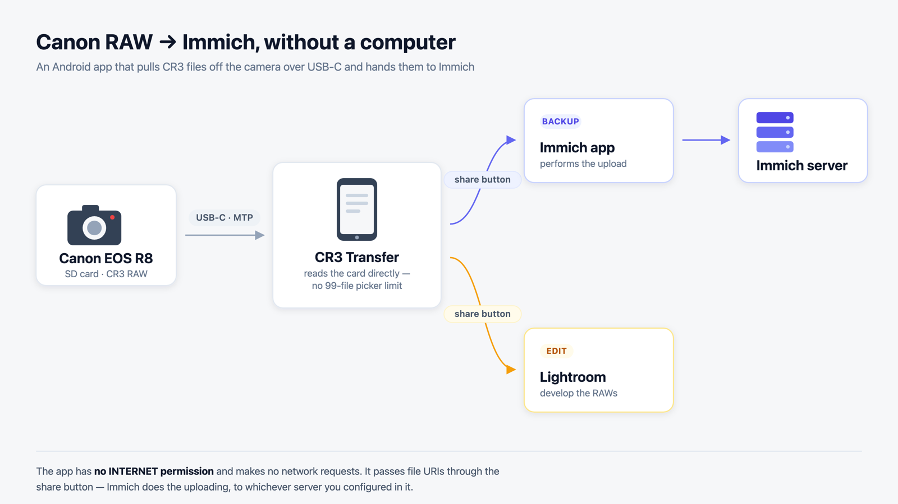
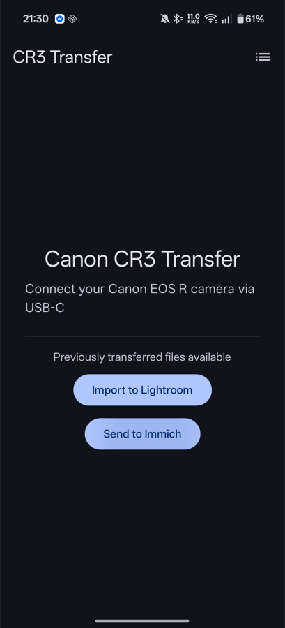
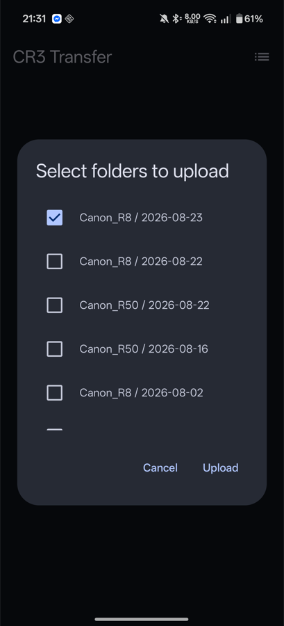

<div align="center">

# Canon CR3 Transfer

**Get RAW files off your Canon and onto your phone — over USB-C, with no computer, no Wi-Fi, and no 99-file limit.**

[](https://github.com/Akopmm/canon-mtp-direct/releases/latest)
[](https://github.com/Akopmm/canon-mtp-direct/releases)
[](#requirements)
[](#how-it-works)

[**Download APK**](https://github.com/Akopmm/canon-mtp-direct/releases/latest) · [Report a bug](https://github.com/Akopmm/canon-mtp-direct/issues) · [Request a feature](https://github.com/Akopmm/canon-mtp-direct/issues/new)

</div>

<br>



<br>

## Why this exists

Android's built-in file picker refuses to hand an app more than **99 files at a time**, which is nothing after an afternoon of shooting. And getting camera RAWs into a self-hosted photo library normally means going home, finding a laptop, and importing from a card reader.

This app talks to the camera **directly over MTP**, so it never touches that picker and has no file-count limit. It copies the files to your phone, then hands them to whatever you actually use — Lightroom to edit, or Immich to back up to your own server.

## Features

| | |
|---|---|
| 📷 **Direct USB-C transfer** | Plug the camera into the phone. No cables to a computer, no Wi-Fi, no cloud. |
| ♾️ **No file limit** | Reads the card over MTP, so Android's 99-file picker cap doesn't apply. |
| 🗂️ **Sort & filter the picker** | Order by capture date or name; filter to just the RAWs, or just the JPEGs. |
| 🖼️ **Real thumbnails** | Embedded previews pulled straight from the RAW files — CR3 and CR2 alike. |
| 🧩 **Old bodies too** | CR3/MP4 from Digic 8 and newer; CR2/MOV from the DSLRs before them. |
| 🧠 **Smart dedup** | Skips what you already transferred — per camera, checked against files on disk, survives a reinstall. |
| 📤 **Send to Immich** | Hands transferred RAWs to the Immich app, which uploads them to your own server. |
| 🎨 **Lightroom import** | Send one date folder or several, with or without the camera connected. |
| 🔋 **Background transfers** | A foreground service keeps a long transfer alive while you use other apps. |
| 📊 **Transfer history** | Past sessions with file counts, size and duration. |
| 🗑️ **Optional delete after transfer** | Free the card as you go, behind a confirmation dialog. |

## Screenshots

<p align="center">
  
  &nbsp;&nbsp;
  
</p>

## Install

1. Download `cr3-transfer.apk` from the [latest release](https://github.com/Akopmm/canon-mtp-direct/releases/latest)
2. Open it on your phone
3. Allow **"Install from unknown sources"** if prompted
4. Grant **"All files access"** when the app opens — it needs this to write into `DCIM/`

## Camera setup

On an **EOS R** body, before connecting:

1. **Menu → Communication settings → Choose USB connection app**
2. Select **Photo Import/Remote Control** — *not* "EOS Utility" or "Register to a smartphone"
3. **Disable auto power-off**, or the camera will drop the connection mid-transfer

On an **older DSLR** (EOS 760D/750D, 80D, 6D…) there is no such menu, but Wi-Fi and the USB port are mutually exclusive on those bodies:

1. **Menu → Set-up 3 → Wi-Fi/NFC → Disable** — with Wi-Fi enabled the USB port stays dead and the phone sees nothing
2. **Disable auto power-off**
3. Their port is Mini-USB, not USB-C, so you need a USB-C **OTG adapter** plus the camera's own cable

> Built and tested against the **Canon EOS R8** upstream. CR2/MOV is confirmed on a **Canon EOS 760D**: files enumerate, thumbnails render from the embedded previews, and transferred CR2s open in Lightroom. Reports from other Canon cameras are welcome either way.

## Usage

1. Connect the camera to the phone (USB-C, or an OTG adapter on older bodies) — the app launches itself
2. Pick what to transfer (sort, filter, or just take the pre-selected new files)
3. Tap **Start Transfer**
4. When it finishes, tap **Import to Lightroom**, **Send to Immich**, or **Open Folder**

Files land in:

```
DCIM/CanonImports/<camera>/YYYY-MM-DD/     photos (CR3, CR2, JPG, HEIF)
Movies/CanonImports/<camera>/YYYY-MM-DD/   videos (MP4, MOV)
```

## How it works

The app drives `android.mtp` against the camera directly rather than going through the Storage Access Framework. It walks the DCIM tree on the card recursively, identifies files by extension (Canon bodies do not reliably report RAW format codes over MTP), and copies each one with `MtpDevice.importFile()` so a 30 MB RAW never has to fit in memory.

Thumbnails come from the camera's own MTP thumbnail when it returns a usable one, and from the file otherwise — which differs by container. A CR3 is ISOBMFF with its preview inline near the start, so the app scans the head of the file. A CR2 is a TIFF whose preview bytes sit far past any header window, so the app parses the image directories instead and fetches just the byte range they point at.

Handing files to Immich or Lightroom is a plain Android share intent — **the app itself holds no `INTERNET` permission and makes no network requests.** Immich does its own uploading, to whichever server you configured in it.

Kotlin throughout, Jetpack Compose UI, MVVM with Hilt, coroutines and Flow. No Room, no Retrofit, no analytics.

## Requirements

- Android 8.0+ (API 26)
- A phone with USB-C **OTG / host mode** support
- A Canon camera that exposes MTP (an OTG adapter too, for Mini-USB bodies)

## Building from source

```bash
git clone https://github.com/Akopmm/canon-mtp-direct.git
cd canon-mtp-direct
./gradlew assembleDebug
# APK at app/build/outputs/apk/debug/app-debug.apk
```

Needs the Android SDK with `compileSdk 36`. There is **no emulator path** — USB host mode requires a physical device with a camera attached.

<details>
<summary>Release signing</summary>

Release builds read signing credentials from `local.properties`, which is not committed:

```properties
KEYSTORE_PATH=../release.jks
KEYSTORE_PASSWORD=your_keystore_password
KEY_ALIAS=cr3transfer
KEY_PASSWORD=your_key_password
```

The `release.jks` keystore is excluded from version control — contact the maintainer for access.

</details>

## Contributing

Issues and pull requests are welcome — particularly reports from **Canon bodies other than the R8 and the 760D**, the two cameras this has been tested against.

## License

MIT

---

<div align="center">

☕ If you find this useful, [buy me a coffee](https://buymeacoffee.com/akopmm)!

</div>
